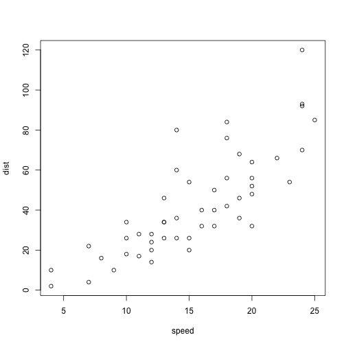

Regression Presentation
========================================================
author: Robert Gulotty
date: November 6, 2020
autosize: true

The Ordinary Least Squares Model
========================================================

In many quantitative papers people display standard outputs from statistical software.  Today we will cover three main ideas.
- How are are the parameters of the model ($\beta$) calculated.
- How are standard errors calculated and summarized
- What diagnostics are reported.

Slide With Code
========================================================


```r
summary(cars)
```

```
     speed           dist       
 Min.   : 4.0   Min.   :  2.00  
 1st Qu.:12.0   1st Qu.: 26.00  
 Median :15.0   Median : 36.00  
 Mean   :15.4   Mean   : 42.98  
 3rd Qu.:19.0   3rd Qu.: 56.00  
 Max.   :25.0   Max.   :120.00  
```

Slide With Plot
========================================================


